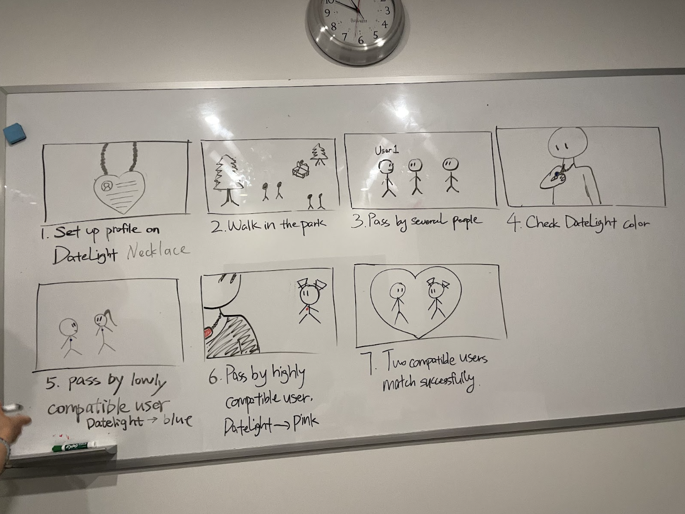
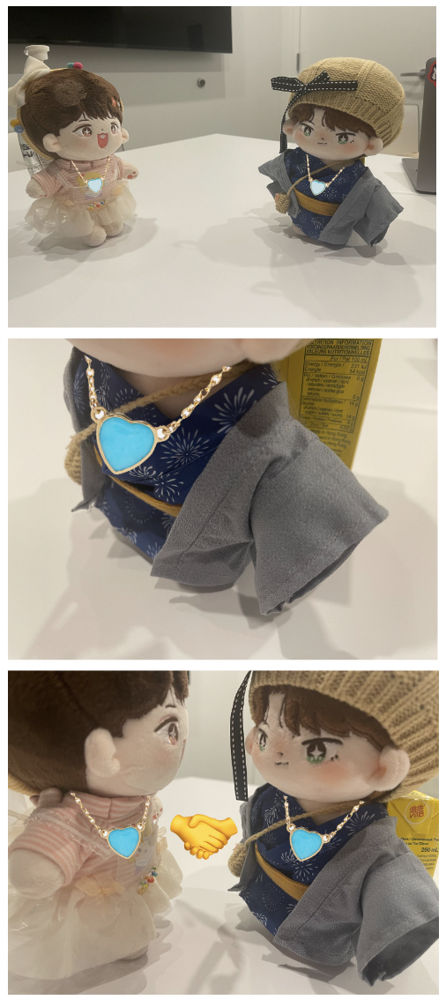
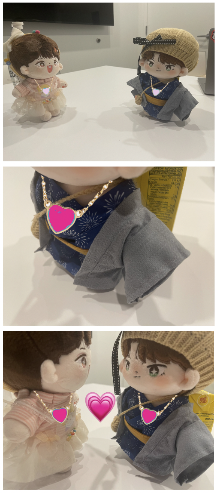
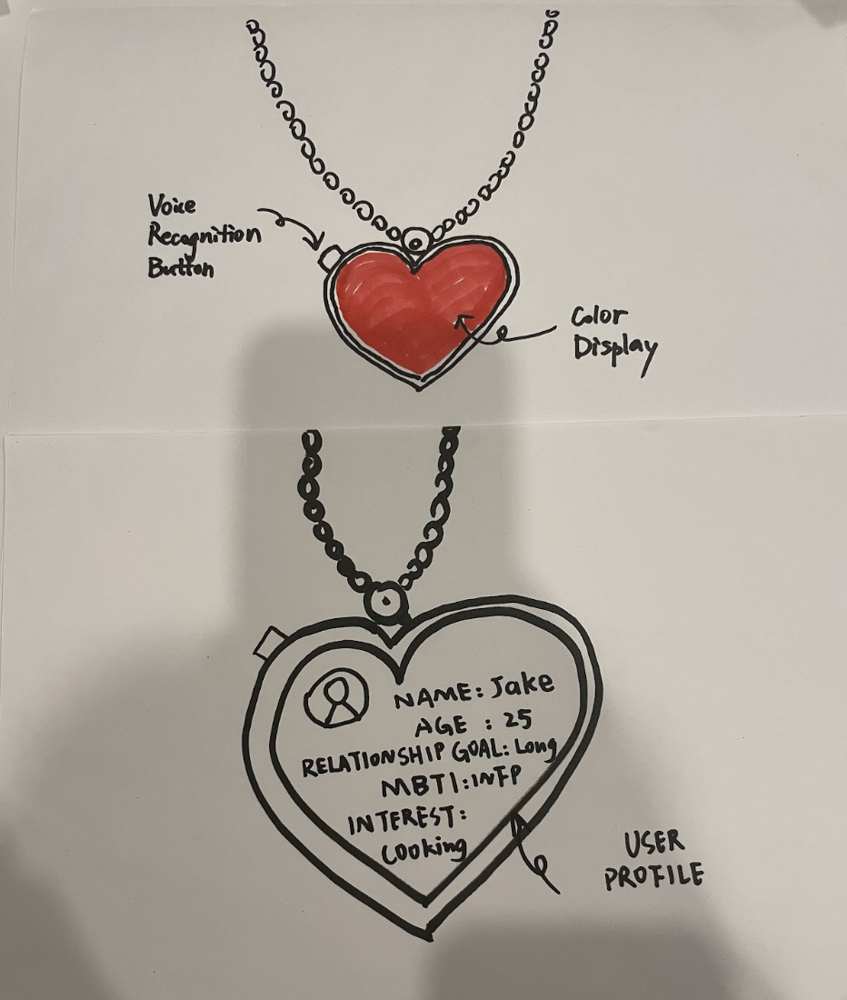

# Staging Interaction

\*\***NAME OF COLLABORATORS HERE**\*\*
Jamie Wang zw448
Yiming Sheng ys2262
Yunfei Jiao yj497

In the original stage production of Peter Pan, Tinker Bell was represented by a darting light created by a small handheld mirror off-stage, reflecting a little circle of light from a powerful lamp. Tinkerbell communicates her presence through this light to the other characters. See more info [here](https://en.wikipedia.org/wiki/Tinker_Bell). 

There is no actor that plays Tinkerbell--her existence in the play comes from the interactions that the other characters have with her.

For lab this week, we draw on this and other inspirations from theatre to stage interactions with a device where the main mode of display/output for the interactive device you are designing is lighting. You will plot the interaction with a storyboard, and use your computer and a smartphone to experiment with what the interactions will look and feel like. 

_Make sure you read all the instructions and understand the whole of the laboratory activity before starting!_

## Prep

### To start the semester, you will need:
1. Read about Git [here](https://git-scm.com/book/en/v2/Getting-Started-What-is-Git%3F).
2. Set up your own Github "Lab Hub" repository to keep all you work in record by [following these instructions](https://github.com/FAR-Lab/Developing-and-Designing-Interactive-Devices/blob/2021Fall/readings/Submitting%20Labs.md).
3. Set up the README.md for your Hub repository (for instance, so that it has your name and points to your own Lab 1) and [learn how to](https://guides.github.com/features/mastering-markdown/) organize and post links to your submissions on your README.md so we can find them easily.

### For this lab, you will need:
1. Paper
2. Markers/ Pens
3. Scissors
4. Smart Phone -- The main required feature is that the phone needs to have a browser and display a webpage.
5. Computer -- We will use your computer to host a webpage which also features controls.
6. Found objects and materials -- You will have to costume your phone so that it looks like some other devices. These materials can include doll clothes, a paper lantern, a bottle, human clothes, a pillow case, etc. Be creative!

### Deliverables for this lab are: 
1. 7 Storyboards
1. 3 Sketches/photos of costumed devices
1. Any reflections you have on the process
1. Video sketch of 3 prototyped interactions
1. Submit the items above in the lab1 folder of your class [Github page], either as links or uploaded files. Each group member should post their own copy of the work to their own Lab Hub, even if some of the work is the same from each person in the group.

### The Report
This README.md page in your own repository should be edited to include the work you have done (the deliverables mentioned above). Following the format below, you can delete everything but the headers and the sections between the **stars**. Write the answers to the questions under the starred sentences. Include any material that explains what you did in this lab hub folder, and link it in your README.md for the lab.

## Lab Overview
For this assignment, you are going to:

A) [Plan](#part-a-plan) 

B) [Act out the interaction](#part-b-act-out-the-interaction) 

C) [Prototype the device](#part-c-prototype-the-device)

D) [Wizard the device](#part-d-wizard-the-device) 

E) [Costume the device](#part-e-costume-the-device)

F) [Record the interaction](#part-f-record)

Labs are due on Mondays. Make sure this page is linked to on your main class hub page.

## Part A. Plan 

To stage an interaction with your interactive device, think about:

_Setting:_ Where is this interaction happening? (e.g., a jungle, the kitchen) When is it happening?

_Players:_ Who is involved in the interaction? Who else is there? If you reflect on the design of current day interactive devices like the Amazon Alexa, it’s clear they didn’t take into account people who had roommates, or the presence of children. Think through all the people who are in the setting.

_Activity:_ What is happening between the actors?

_Goals:_ What are the goals of each player? (e.g., jumping to a tree, opening the fridge). 

The interactive device can be anything *except* a computer, a tablet computer or a smart phone, but the main way it interacts needs to be using light.

\*\***Describe your setting, players, activity and goals here.**\*\*
Setting: In the central park, where passersby are scattered in a moderate density.

Players: Users who use the DateLight app

Activity: 
1. User individually set up a dating profile on DateLight
2. DateLight can be accessed on smartphones, tablets, and smart watches
3. DateLight would auto-compare two profiles and output a matching score from 0-100 (least matchable to most matchable)
4. Score 0-100 mirrors to the gradient shift of blue to bright pink
5. DateLight will detect DateLight users within 10-meters radius and display colors to show compatibility
6. When two users’ matching score is higher than 80, DateLight will alert both users that a high-matching candidate is within the radius, and their devices would vibrate/play sound

Goals: To help user make friends/find love in a big city 
1. Set up profile 
2. Walk in the park 
3. Pass by several people
4. Nothing happened (profile match 40%)
5. Light stays blue 
6. Profile matches 80%
7. Light turns pink

Storyboards are a tool for visually exploring a users interaction with a device. They are a fast and cheap method to understand user flow, and iterate on a design before attempting to build on it. Take some time to read through this explanation of [storyboarding in UX design](https://www.smashingmagazine.com/2017/10/storyboarding-ux-design/). Sketch seven storyboards of the interactions you are planning. **It does not need to be perfect**, but must get across the behavior of the interactive device and the other characters in the scene. 

\*\***Include pictures of your storyboards here**\*\*

Present your ideas to the other people in your breakout room (or in small groups). You can just get feedback from one another or you can work together on the other parts of the lab.

\*\***Summarize feedback you got here.**\*\* 
Distance should be considered when designing which user in the range would DateLight compare to;
Besides light signals, we could also utilize audio or vibrations. Considering the cases where the users are in public settings, vibrations might be a better complement;
Matching users solely based on heart rate is not sufficiently accurate, as confounding factors such as workouts or nervousness before an interview can also influence users' heart rates.

## Part B. Act out the Interaction

Try physically acting out the interaction you planned. For now, you can just pretend the device is doing the things you’ve scripted for it. 

\*\***Are there things that seemed better on paper than acted out?**\*\*

No.

\*\***Are there new ideas that occur to you or your collaborators that come up from the acting?**\*\*

Yes. Initially, our plan was to instantly switch the color from white to pink when two matched users connect. However, as we delved into the implementation, we found that a color transition could be helpful to indicate the distance between the users. As these two users move closer to one another, the illumination of the necklace smoothly shifts, gradually progressing from white to pink. 

## Part C. Prototype the device

You will be using your smartphone as a stand-in for the device you are prototyping. You will use the browser of your smart phone to act as a “light” and use a remote control interface to remotely change the light on that device. 

Code for the "Tinkerbelle" tool, and instructions for setting up the server and your phone are [here](https://github.com/FAR-Lab/tinkerbelle).

We invented this tool for this lab! 

If you run into technical issues with this tool, you can also use a light switch, dimmer, etc. that you can can manually or remotely control.

\*\***Give us feedback on Tinkerbelle.**\*\* 
1.The color display on the device cannot be full-screened, which could lessen the visuals.
2. Connection is unstable.
3. A short delay between the web pages and mobile phones

## Part D. Wizard the device
Take a little time to set up the wizarding set-up that allows for someone to remotely control the device while someone acts with it. Hint: You can use Zoom to record videos, and you can pin someone’s video feed if that is the scene which you want to record. 

\*\***Include your first attempts at recording the set-up video here.**\*\*
[https://drive.google.com/file/d/1fG6l322X2uXxhh3saRHildSWYw7ITd5b/view?usp=drive_link]
Now, hange the goal within the same setting, and update the interaction with the paper prototype. 

\*\***Show the follow-up work here.**\*\* 
Additional to the primary goal of finding a romantic match, we have incorporated friend match as the second goal.
#### Friend match

#### Romantic match

## Part E. Costume the device

Only now should you start worrying about what the device should look like. Develop three costumes so that you can use your phone as this device.

Think about the setting of the device: is the environment a place where the device could overheat? Is water a danger? Does it need to have bright colors in an emergency setting?

\*\***Include sketches of what your devices might look like here.**\*\* 
#### Necklace 

#### Bracelet 

#### LED Tattoo 

\*\***What concerns or opportunitities are influencing the way you've designed the device to look?**\*\* 

1.We designed the device to be wearable as a necklace because we want to separate the experience from regular phone activities. 
2.Necklace also serves as a signifier of DateLight users, so that the matched users can recognize each other easier.

## Part F. Record

\*\***Take a video of your prototyped interaction.**\*\* 

[https://drive.google.com/file/d/1VxQS166BEHAgQCaaZFfYuPLWLQ0Nm3Uh/view?usp=drive_link]

[https://drive.google.com/file/d/12jAs5-VU3SbIDLBQYz586Fko66O4zGcw/view?usp=drive_link]

\*\***Please indicate anyone you collaborated with on this Lab.**\*\*
Be generous in acknowledging their contributions! And also recognizing any other influences (e.g. from YouTube, Github, Twitter) that informed your design. 

_Members: Jamie Wang, Yiming Sheng, Yunfei Jiao_

# Staging Interaction, Part 2 

This describes the second week's work for this lab activity.

## Prep (to be done before Lab on Wednesday)

You will be assigned three partners from another group. Go to their github pages, view their videos, and provide them with reactions, suggestions & feedback: explain to them what you saw happening in their video. Guess the scene and the goals of the character. Ask them about anything that wasn’t clear. 

\*\***Summarize feedback from your partners here.**\*\*

- Hard to differentiate users when more than 2 people are within the detection range   
- Add pointer arrows to indicate the direction of potential matches   
- Examine the feasibility of this product  
- profile picture for each user could be removed

## Make it your own

Do last week’s assignment again, but this time: 
1) It doesn’t have to (just) use light, 
2) You can use any modality (e.g., vibration, sound) to prototype the behaviors! Again, be creative! Feel free to fork and modify the tinkerbell code! 
3) We will be grading with an emphasis on creativity. 

\*\***Document everything here. (Particularly, we would like to see the storyboard and video, although photos of the prototype are also great.)**\*\*

IDD-2 Team members: Jamie Wang, Yiming Sheng, Yunfei Jiao *

## Ex.1 Restroom communication system
Part A. 
Setting: Inside a public restroom. Lights are installed on the wall inside and outside of restroom stalls  
Players: The person occupying a bathroom stall and the people waiting outside for using the restroom 
Activity: 
1. Inside the stall, the person using the restroom input the time they estimate themselves to be occupying the restroom 
2. The time will be transferred to a light signal on the outside of the stall (5 min-blue, 10 min-yellow, above-orange). 
3. People waiting outside sees the time and make decision to stay or switch restroom 
Goals: Enhance bathroom usage efficiency 
**Include pictures of your storyboards here**

Part B
**Are there things that seemed better on paper than acted out?**
No.
**Are there new ideas that occur to you or your collaborators that come up from the acting?**
No.
Part F. Record
**Take a video of your prototyped interaction.**

https://github.com/jamiewang76/Interactive-Lab-Hub/assets/57398429/afed3a01-6abb-49b8-b2d8-91a0502d5119

## Ex.2 Price-calculating light
Part A. 
Setting: In a grocery store 
Players: A customer shopping in the store with a shopping cart 
Activity: The customer sets a total amount of money he/she wants to keep the purchase under. As he/she puts an item into the cart, the price-calculating light will start adding up the prices and reflect the total amount to its color. After the amount exceeds the set goal, the light will turn red and vibrate intensely. 
Goals: Help shoppers to stay rational by keeping track of their purchase amount so that they can adjust item selection in real-time 
**Include pictures of your storyboards here**

Part B
**Are there things that seemed better on paper than acted out?**
No.
**Are there new ideas that occur to you or your collaborators that come up from the acting?**
No.
Part F. Record
**Take a video of your prototyped interaction.**

https://github.com/jamiewang76/Interactive-Lab-Hub/assets/57398429/a692f021-954e-46ca-87e9-885cd794c089

## Ex.3 Distraction preventive timer
Part A. 
Setting: Users are expected to set up the light cubes in their study environment.  
Players: A user that needs to study/work 
Activity: The user inputs their target focus time and pats the cube light to start the timer which is the light itself.  The light will visualize the procession of time and display special effects after accomplishment. It also detects distraction behaviors of the user and gives warning by vibration/changing light color to red. 
Goals: The goal of the user is to keep focus on their tasks for a duration of time 
**Include pictures of your storyboards here**

Part B
**Are there things that seemed better on paper than acted out?**
No.
**Are there new ideas that occur to you or your collaborators that come up from the acting?**
No.
Part F. Record
**Take a video of your prototyped interaction.*

https://github.com/jamiewang76/Interactive-Lab-Hub/assets/57398429/19cc1552-46fb-4dc4-9cb6-d1254a65af98

## Ex.4 Ubiquitous direction-guidance
Part A. 
Setting: Along park pavements there installed a great number of direction-guiding devices 
Players: An old man who doesn’t use cell phones and need directions to a destination 
Activity: The old man walks to a device along the pavement and speaks out the destination he wants to get to. The device will confirm his input and then send signals to other devices along the path suggested for the man. The devices along the path will light up. 
Goals: Give people visual guides in the real world to the place they want to reach. 
**Include pictures of your storyboards here**

Part B
**Are there things that seemed better on paper than acted out?**
No.
**Are there new ideas that occur to you or your collaborators that come up from the acting?**
No.

## Ex.5 To-do list tracker
Part A. 
Setting: In a study room 
Players: A student 
Activity: The student writes up a to-do list and assigns each to-do item to a section of her to-do light board. Every time she finishes a task, she presses that corresponding section to turn the light off. 
Goals: Give people a visualization of their working progress and motivations to keep working. 
**Include pictures of your storyboards here**

Part B
**Are there things that seemed better on paper than acted out?**
No.
**Are there new ideas that occur to you or your collaborators that come up from the acting?**
No.

## Ex.6 Severe weather alert
Part A. 
Setting: A bridge crossing a river. Many people live near the bridge or commute through the bridge. 
Players: Cars driving along the bridge and residents on the banks. 
Activity: The severe-weather alert lights are installed along the bridge and the banks. The lights are connected to the city forecast station which sends signals whenever a severe weather condition is forecast to occur. 
Goals: Alert nearby people to evacuate when extreme weathers come. 
**Include pictures of your storyboards here**

Part B
**Are there things that seemed better on paper than acted out?**
No.
**Are there new ideas that occur to you or your collaborators that come up from the acting?**
No.

**Please indicate anyone you collaborated with on this Lab.**  
Jamie Wang zw448 Yiming Sheng ys2262 Yunfei Jiao yj497

